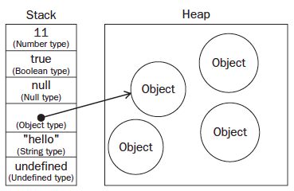

# Book Notes on JavaScript for Web Developers

## 1. What is JavaScript?

**JavaScript** is a scripting language designed to interact with web pages.

######3 distinct parts:
- ECMAScript - defined in ECMA-262 and provides the core functionality
- Document Object Model (DOM) - provides methods and interfaces for working with
the content of a web page
- Browser Object Model (BOM) - provides methods and interfaces for interacting with
the browser

######Browser compatibility:
- ECMAScript - good across all browsers
- DOM - varies widely
- BOM - no standard, some commonalities

## 2. JavaScript in HTML

- Insert JavaScript to HTML in two ways: **inline** or from **external file**.
- Declare `type` attribute as "text/javascript".
- Set `src` to the URL of the file.

*inline JavaScript*
```
<script type="text/javascript" src="jquery.min.js"><script>
```
*JavaScript from external file*
```
<script type="text/javascript" src="https://ajax.googleapis.com/ajax/libs/jquery/1.11.2/jquery.min.js"></script>
```

- All `<script>` elements are interpreted in the order in which they occur on the page.
- `<script>` elements are usually included toward the end of the page, just before the closing `</body>` tag.
- Defer a script’s execution until after the document has rendered by using the `defer` attribute (for IE only).
- Use `<noscript>` to specify that content is to be shown only if scripting support isn’t available on the browser.

## 3. Language Basics

### On Syntax
1. Case-sensitivity - `typeof` != `typeOf`
2. Identifiers - starts with a letter, `_`, or `$`; functions are in camelCase
3. Comments - use `//comment` for single line, and `/* comment */` for multi line
4. Statements - use semicolons `;` for single lines, and code blocks `{ }`for multiple & control statements

### Variables
- loosely-typed (can hold any type of data, though not best to switch from one to another)
- `var` to define a variable in local scope e.g.`var name='Nadine';`
- no `var` to define a variable globally (not recommended) e.g. `name='Nadine';`
- define multiple variables e.g. `var message='hi', name='nadine', age='23';`

### Data Types

##### Primitive types
1. Undefined - any uninitialized variable
2. Null - empty object pointer
3. Boolean - `true` or `false` (distinct from `1` and `0`)
4. Number - convert to number using `Number()`, `parseInt()`, `parseFloat()`; `NaN` when not a number
5. String - convert to string using `toString()`, `String()`

##### Complex type
6. Object (unordered list of name-value pairs)

Determine data type with `typeof` operator. e.g. `alert(typeof 23);`

### Operators

##### Unary Operators - works on only one value
- Increment/Decrement
	- prefix
		- `++variable;` --> `variable = variable + 1;`
		- `--variable;` --> `variable = variable - 1;`
	- postfix
		- `variable++;` or `variable--;`
		- works the same way as prefix
		- executed only after the containing statement is evaluated
- Unary Plus and Minus
	- `+variable;` or `-variable`
	- performs the `Number()` casting function
	- minus `-` applies `Number()` and negates the value
	
##### Bitwise Operators - works with bits that represent numbers (32-bit integer)
- Bitwise NOT (`~`)
	- returns one's complement of the number
	- negates a number and subtracts 1
- Bitwise AND (`&`)
	- lines up the bits in each number and performs an AND operation between the two bits in the same position
- Bitwise OR (`|`)
	- lines up the bits and performs an OR operation
- Bitwise XOR (`^`)
	- lines up the bits and returns 1 only when exactly one bit has a value of 1
- Left Shift (`<<`)
	- shifts all bits in a number to the left by the
number of positions given
	- left shift fills
empty bits with 0s to make the result a complete 32-bit number
	- preserves the sign of the number it's operating on
- Signed Right Shift (`>>`)
	- shifts all bits to the right while preserving the sign
	- the empty bits occur at the left of the number after the "sign bit"
- Unsigned Right Shift (`>>>`)
	- shifts all bits to the right
	- empty bits get filled with zeros regardless of the sign of the number
	
##### Boolean Operators
- Logical NOT (`!`) 
	- converts the operand to a Boolean value and then negates it
	- use `!!` to sumulate `Boolean()`
- Logical AND (`&&`)
	- short-circuited - if the 1st operand is *false*, the 2nd operand will never be evaluated
- Logical OR (`||`)
	- short-circuited - if the 1st operand is *true*, the 2nd operand will never be evaluated
	- used to avoid assigning a null or undefined value to a variable 
	- e.g. `var myObject = preferredObject || backupObject;`
	
##### Multiplicative Operators
If either operand is NaN, it is converted to a number using `Number()`.

- Multiply (`*`)
- Divide (`/`)
- Modulus (`%`)

##### Additive Operators
- Add (`+`)
	- If both operands are strings, the second string is concatenated to the first.
	- If only one operand is a string, the other operand is converted to a string and the result is the
concatenation of the two strings.
	- If either operand is an object, number, or Boolean, its `toString()` method is called.
	- surround two number variables by parentheses before concatenating
- Subtract (`-`)
	- If either operand is a string, a Boolean, null , or undefined , it is converted to a number using `Number()`
	- If either operand is an object, `valueOf()` is called. If that value is `NaN`, then the result is NaN . If the object doesn’t
have `valueOf()` defined, then `toString()` is called and then `Number()`


##### Relational Operators

- less-than (`<`)
- greater-than (`>`)
- less-than-or-equal to (`<=`)
- greater-than-or-equal to (`>=`)

Rules:

- If the operands are strings, compare the character codes of each corresponding character in
the string.
	- the character codes of uppercase letters are all lower than the character codes of lowercase letters
	- convert strings to lowercase e.g. `“Brick”.toLowerCase();`
- If one operand is a number, convert the other operand to a number.
- If an operand is an object, call `valueOf()`. If not available, call `toString()`.
- If an operand is a Boolean, convert it to a number.

##### Equality Operators
- Equal (`==`) and Not Equal (`!=`)
- Identically Equal (`===`) and Not Identically Equal (`!==`)
	- they do not convert operands before testing for equality
	- It is recommended to use this operator to maintain data type integrity throughout your code.
	
##### Conditional Operator
- `variable = boolean_expression ? true_value : false_value;`

##### Assignment Operator
- done with `=` and assigns the value on the right to the
variable on the left
- Compound-assignment operators (shorthand only; no performance improvement)
	- Multiply/assign ( `*=` )
	- Divide/assign ( `/=` )
	- Modulus/assign ( `%=` )
	- Add/assign ( `+=` )
	- Subtract/assign ( `-=` )
	- Left shift/assign ( `<<=` )
	- Signed right shift/assign ( `>>=` )
	- Unsigned right shift/assign ( `>>>=` )

##### Comma Operator
- used in the declaration of variables e.g. `var num1=1, num2=2, num3=3;`
- It can also be used to assign values; It always returns the last item in an expression e.g. `var num = (5, 1, 4, 8, 0); //num becomes 0`
	

### Statements

##### *if* statement 
- syntax: `if (condition) statement1 else statement2`
- always use block statements
- automatically converts the result of the expression into a Boolean by calling `Boolean()`
- allows chaining

##### *do-while* statement 
- syntax: `do { statement } while (expression);`
- a post-test loop - the escape condition is evaluated only
after the code inside the loop has been executed
- the body of the loop should be
executed at least once before exiting

##### *while* statement 
- syntax: `while (expression) statement`
- a pretest loop - the escape condition is evaluated before the code inside the loop has been executed

##### *for* statement 
- syntax: `for (initialization; expression; post-loop-expression) statement`
- e.g. `var count = 10;
for (var i=0; i < count; i++){
alert(i);
}`
- Nothing can be done with a for loop that can ’ t be done using a while loop.
- A variable defined inside the loop is accessible outside the loop as well.

##### *for-in* statement
- syntax: `for (property in expression) statement`
- strict iterative statement - used to enumerate the properties of an object
- The var operator in the control statement is not necessary but is recommended for ensuring the use of a local variable.

##### Labeled statement
- syntax: `label: statement`
- can be referenced later by using the `break` or `continue` statement

##### *break* and *continue* statements
- provide stricter control over the execution of code in a loop
- `break` exits the loop immediately, forcing execution to continue with the next statement after
the loop
- `continue` exits the loop immediately, but execution
continues from the top of the loop


##### *with* statement
- syntax: `with (expression) statement;`
- sets the scope of the code within a particular object
- created as a convenience for times when a single object was being coded to over and over again
- widely considered a poor practice to use the with statement in production code

##### *switch* statement
- For each case, if the expression is equal to the value, the statement is executed.
- `break` causes code execution to jump out of the switch statement
- without `break`, code falls through (always put comment if done on purpose)
- `default` indicates what is to be done if the expression does not evaluate to one of the cases
- works with all data types, can be used with strings and objects
- Case values need not be constants; they can be variables and even expressions.
- Values are compared using the identically equal operator, so no type coercion occurs.

```
switch (expression) {
	case value: statement
		break;
	case value: statement
		break;
	case value: statement
		break;
	case value: statement
		reak;
	default: statement
}
```


### Functions
Functions allow the encapsulation of statements that can be
run anywhere and at any time.

```
function sum(num1, num2) {
 return num1 + num2;
}
```
- Return a value anytime by using the `return` statement. 
- A function stops and exists when `return` is encountered. 
- Without a return value, function returns `undefined`.

##### Arguments

- no. of arguments passed in and data types don't matter
- no *function signature*
- `arguments` - an **array** containing zero or more values where arguments are passed
	- Any number of arguments can be passed into a function and are accessible through the `arguments` object.
	- `arguments` object can be used in conjunction with named arguments.
	- `arguments` object can also be used to check the number of arguments passed into the function via the length property.
- Any named argument that is not passed into the function is automatically
assigned the value `undefined`.

```
function sayHi() {
	alert(“Hello “ + arguments[0] + “,” + arguments[1]);
}
```

##### No Overloading

- no overloading due to lack of function signatures
- if same name, the last function becomes the owner of that name
- simulate overloading by checking the type and number of arguments that have been passed into a function, and then reacting accordingly


## 4. Variables, Scope, and Memory


**variable** - loosely typed; a name for a particular
value at a particular time

### Primitive and Reference Values


#####Primitive values

- i.e. boolean, null, undefined, number, string
- data that are stored in one memory locatin on the *stack*, takes up a fixed amount of space
- variables are said to be accessed by *value*


#####Reference values

- value is just a pointer to another memory location (in the *heap*) where the object is stored
- cannot be stored on the stack because they don't have fixed sizes
- a memory address has a fixed size, so it is placed on the *stack*
- objects may require different amounts of memory so heap is not accessed sequentially


### Dynamic Properties



